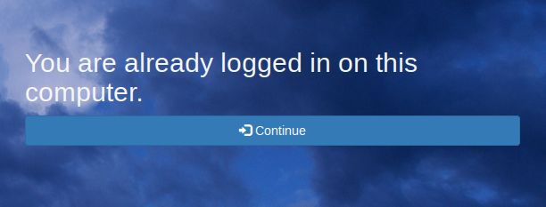

# CloudChat
## Maturitní projekt 2015/2016 
### Jakub Mach, 4.B

Toto je dokumentace k maturitní práci nazvané *Cloudová chatovací aplikace*.
Kód maturitní práce se skládá celkem ze tří částí, v této dokumentaci detailně popíši co, jak a proč v těchto třech částech funguje
a uvedu návod k instalaci aplikace na vlastní server.

## Obsah:
* Část nultá: HTML & CSS
* Část první: Klientská JavaScript část
* Část druhá: API endpoint
* Část třetí: Serverová (bouncer) část
* Návod k instalaci

## Část nultá: HTML & CSS
Kód "nulté" části byl vytvořen jako první (a byl postupem času modifikován) a hlavně jako základ pro další tvorbu. Napsal jsem ho proto, že jsem chtěl stránky statické a dynamičnost těmto stránkám bude přidána až za pomocí JavaScriptu. Jelikož nejsem moc na grafiku a frontend, rozhodl jsem se si práci zjednodušit front-endovou knihovnou jménem *Twitter Bootstrap*.
Kód této části sestává z několika HTML5 a CSS3 souborů, které nyní popíši: 
### index.html
**Hlavní stránka aplikace**, rozdělena na 3 části: navigace, pod ním header s registrací nového uživatele a krátký souhrn informací o aplikaci.
Navigace má celkem tři odkazy, první vede na počátek stránky, druhý vede na "krátký souhrn informací o aplikaci", třetí je odkaz na přihlašovací stránku.
Část s registrací používá obrázek bouřkových mraků s volnou licencí ze služby Flickr.
### login.html
Jedná se o stránku vzhledově podobnou stránce hlavní, na které i byla založena, ovšem místo registračního formuláře se zde vyskytuje **formulář pro přihlášení**.
Pokud je uživatel přihlášen tak je formulář dynamicky skryt (více o tom v části první) a místo něj je zobrazeno tlačítko pro přesměrování do samotné aplikace.



### chat.html
Nejdůležitější z HTML stránek je stránka chat.html, která již má spoustu statických prvků, které se zdynamičťují JavaScriptovou logikou popsanou v části první.

## Část první: Klientská JavaScript část
Klientská javascript část se skládá z několika funkcí a globálních proměnných. Využívá knihovny jQuery k práci s DOM elementy a k posílání ajax požadavků.
### homepage.js
Obsahuje pouze ajax request pro registrační formulář.
### loginpage.js
Obsahuje ajax request, který se vykoná při načtení stránky a odešle API serveru session cookie uživatele, pro zjištění, zda není již uživatel přihlášen. Pokud je uživatel již přihlášen, zobrazí se formulář 
### chatpage.js
Hlavní javascriptová část celé aplikace, používaná v souboru **chat.html**.
Začíná několika globálními proměnnými, uchovávající informace pro správný běh jako například seznam identifikačních čísel zpráv v určitých kanálech.
Při úspěšném načtení DOM se zavolá funkce onChatLoad, která zjistí, zda je uživatel přihlášen a pokud není, je poslán na přihlašovácí stránku, dále pak načte globální informace do proměnné, přiřadí funkci tlačítku pro odeslání zprávy a spustí první instanci timeru, který volá metodu ping.

#### Funkce ping()
Funkce ping obsluhuje stahování nových zpráv pro kanály a servery. Je volaná každých 1500 ms.
Dále také kontroluje, zda je uživatel stále přihlášen, pokud není, je z aplikace poslán na přihlašovácí stránku login.html.

#### Ajax requesty
V celém souboru chatpage.js se vyskytuje spousta ajax requestů, které volají API backend pro učinění nějaké operace a reagování na odpověď od API.
Využívá se k tomu jquery asynchronní metoda post (vyvolávající metodu POST), díky které nemůžou prohlížeče cachovat výsledky a můžou posílat formdata a přijímat JSON, který API server vrací.
Při správném vykonání se vyvolají příkazy v rámci .success(), při selhání vykonání požadavku se vyvolají příkazy v rámci .fail(). Selhání většinou nastane, pokud je API server nepřipraven přijímat požadavky, připojení k internetu není k dispozici, nebo nastala během vyvolání požadavku v API vyjímka.


### asdf


## Část druhá: API endpoint
API endpoint využívá knihovny Flask a je rozdělen na dvě části:
První část s pomocnými utilitními funkcemi, které jsou v druhé části. 

## Část třetí: Serverová (bouncer) část


## Návod k instalaci
Tento návod je pro systém Debian, ovšem podobné principy a názvy balíků jsou podobné/stejné i na jiných distribucích Linuxu.
### 1. Instalace software
V prvním kroku je třeba nainstalovat HTTP server apache spolu s módem WGSI pro vyvolávání API části ve Flasku a databázový server a klient MariaDB (případně MySQL)
Dále budeme potřebovat pip3, abychom nainstalovali některé další závislosti jak pro API část, tak i pro serverovou část.
```
sudo apt-get install apache2 libapache2-mod-wsgi-py3 mariadb-server mariadb-client python3-pip python3-flask
```

### 2. Python závislosti
* ~flask~
* irc
* hashlib
* mysql-connector-python
```
sudo pip3 install hashlib mysql-connector-python irc
```


### 3. Import SQL struktury
Před použitím musíme importovat základní SQL strukturu.
#### Vytvoření databáze
```
echo "CREATE DATABASE nazev_databaze" | mysql -u username -p
```
případně
```
mysql -u username -p -e "CREATE DATABASE nazev_databaze" 
```
#### Importování struktury z SQL souboru
Nyní strukturu importujeme do databáez, kterou jsme právě vytvořili:
```
cat struktura.sql > mysql -u username -p -D nazev_databaze
```

### 4. Apache2 konfigurace
#### Konfigurační soubor VHostu
Pro správný běh musí wgsi API na běžet na portu 5000, je nutno změnit/založit soubor s virtuálnímy hosty.
Následující příklad je úprava výchozího konfiguračního vhost souboru /etc/apache2/sites-available/00-default.conf
```
Listen 5000 # posloucháme i na portu 5000 (port 80 je v tomto příkladě již poslouchán ve výchozím apache konfiguračním souboru)
            # pozor: pokud se Listen stejného portu vyskytuje v několika konfiguračních souborech naráz, dojde k chybě,
            # kdy na daném portu apache nebude poslouchat vůbec!

<VirtualHost *:80> # virtuální host statických stránek 
	ServerName server.eu # hostname statických stránek

	ServerAdmin webmaster@lserver.eu
	DocumentRoot /var/www/html
    
    <Directory /var/www/html/>
            Order deny,allow
            Allow from all
    </Directory>


</VirtualHost>

<VirtualHost *:5000> # virutální host API
    ServerName server.eu # hostname api, musí být stejné jako hostname statických stránek       

    WSGIDaemonProcess cloudchat user=user1 group=group1 threads=5
    WSGIScriptAlias / /var/www/cchat.wgsi # VALIDNÍ CESTA K .WGSI souboru, nejlépe o úroveň výše, než je soubor api.py
    WSGIScriptReloading On # pokud API spadne, znovu načíst

    <Directory /var/www/cloudchat> 
        WSGIProcessGroup cchat
        WSGIApplicationGroup %{GLOBAL}
        Order deny,allow
        Allow from all

    </Directory>
</VirtualHost>
```

#### Vytvoření uživatelského účtu pro WGSI
V předchozím kroku jsme nakonfigurovali WGSI s uživatelským jménem user1 a skupinou group1, musíme tohoto uživatele  a tuto skupinu vytvořit.
```
$ useradd user1 && groupadd group1 && usermod -g group1 user1
```

#### Vytvoření souboru wgsi
Je nutné vytvořit soubor WGSI, aby Apache vědělo, co má vlastně volat. Cesta musí být stejná jako cesta v konfiguračním souboru apache (vizte výše).
Tedy v našem případě vytvoříme soubor /var/www/cchat.wgsi a vložíme do něj:
```
import sys, os
sys.path.insert(0,'/var/www/cloudchat') # hackhack
os.chdir("/var/www/cloudchat")
from api import app as application # import samotneho api.py souboru
```

### 5. Spuštění server.py na pozadí
```
cd server/
python3 main.py &
```

### 6. Nakopírování potřebných souborů
#### Statické stránky
Zkopírujeme do stejné složky, kterou jsme zvolili pro statické stránky v apache2 vhost konfiguráku.
```
mkdir /var/www/html
cp -r static/ /var/www/html
```
#### API
Zkopírujeme do stejné složky, kterou jsme zvolili ve WGSI souboru!!
```
mkdir /var/www/cloudchat/
cp api/api.py /var/www/cloudchat/
```

### 7. Spuštění apache2
```
systemctl start apache2
```

### 8. Hotovo
Pokud se vše správně podařilo, měla by klientská část nyní běžet na portu :80 na námi nastavené doméně a na portu :5000 by měla fungovat API.
Zda API běží můžeme zkontrolovat požadavkem http://domena:5000/, měl by se vrátit JSON s informací, že API běží.
"Realným testem API (a následně i bouncer části)" je pak registrace klienta na http://domena/index.html.